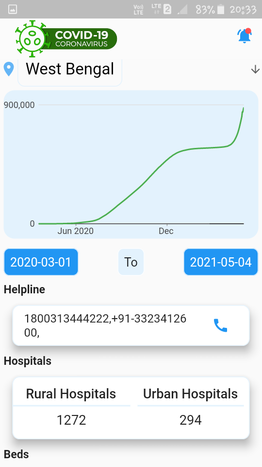
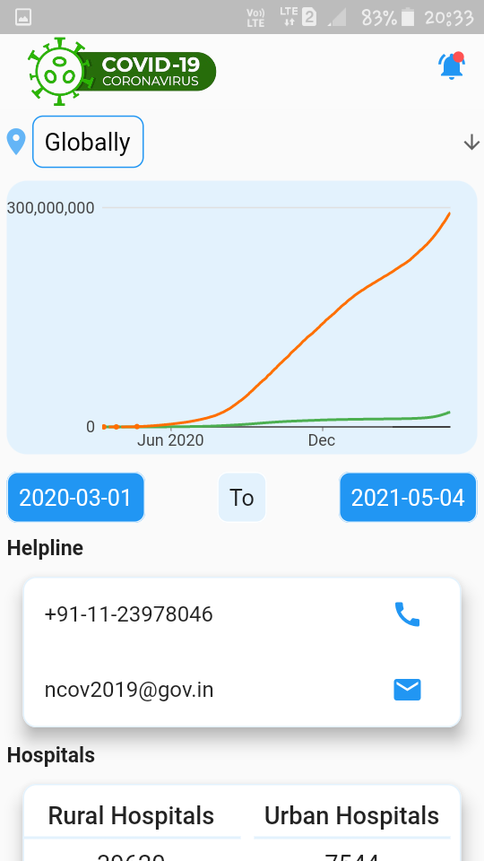
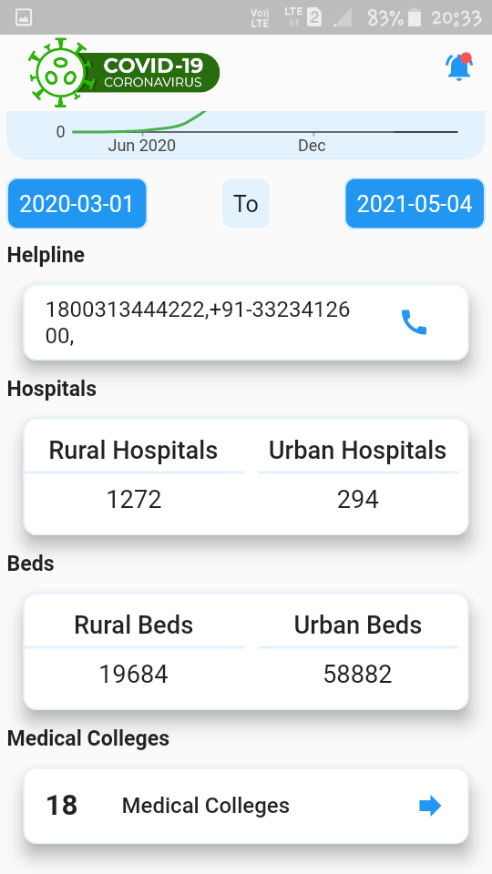
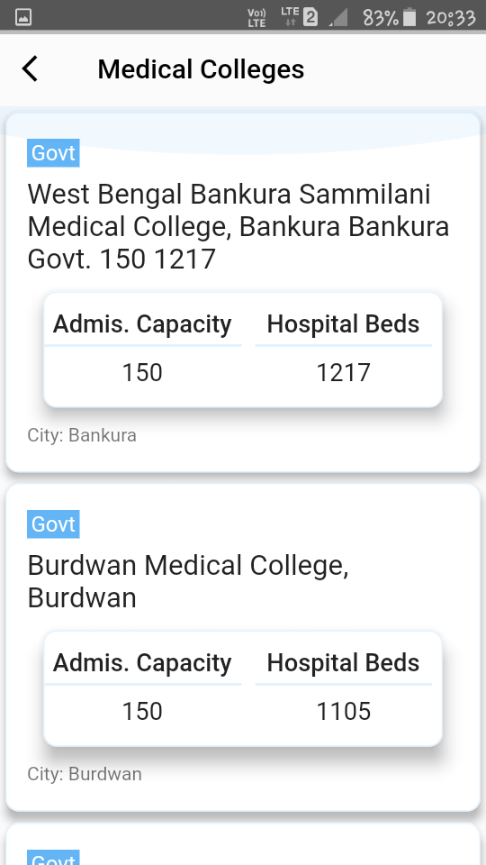
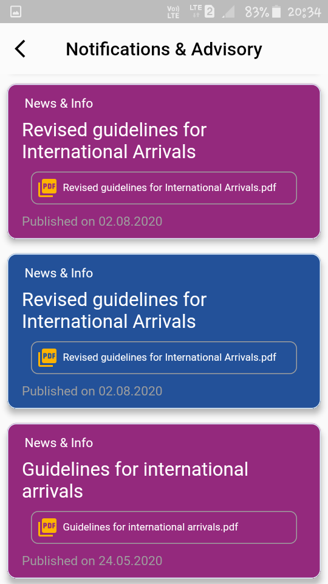

# covid19-information-flutter
Covid19 flutter application which uses COVID-19 REST API for India (api.rootnet.in). Showing information about covid19 in very representative way. Hope it will help in this crucial pandemic 

Download the app <a href="https://drive.google.com/file/d/1IEk6DhRal-Xyxr035-MigNLJkv263AIK/view?usp=sharing" target="_blank" title="Download from Google drive"> Link </a>

|                                                             |                                                           |
| ------------------------------------------------------------| --------------------------------------------------------- |
|  |  |
|  |  |
|  |  |

